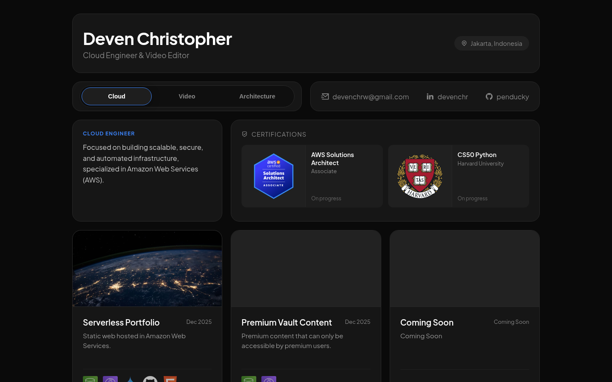
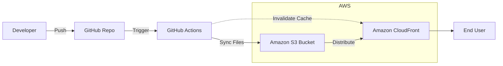

# Serverless Cloud Portfolio ☁️


A globally distributed, **serverless** portfolio engineered on AWS (S3 & CloudFront), featuring a fully **automated CI/CD** pipeline and **AI-accelerated frontend** development.

---
<div align="center">

</div>

### 🔗 [View Live Site](https://dox0mjppevydi.cloudfront.net)

---


## 🎯 Project Goal
To engineer a high-performance, maintenance-free portfolio completely in AWS Free Tier that demonstrates competency in **Cloud Infrastructure**, **CI/CD Automation**, and **Modern Web Standards**.

## 🏗️ Architecture & Engineering Decisions
We intentionally chose a **Serverless Architecture** to prioritize scalability and minimize operational overhead.



### 1.  Storage: Amazon S3

We utilize Amazon S3 for serverless static asset storage.
* **Reason:** S3 provides 11 9s of data durability and virtually unlimited scalability with zero infrastructure maintenance. It is significantly more cost-effective than **EC2**, which incurs idle costs and high management overhead (OS patching, scaling) unnecessary for static content.

### 2.  Delivery: Amazon CloudFront
We utilize Amazon CloudFront as a CDN to accelerate global delivery and enforce security.
* **Reason:** CloudFront caches content at edge locations to minimize latency to the user. We chose this over **S3 Static Website Hosting**, which lacks HTTPS support and requires public bucket access, and over **AWS Amplify**, which abstracts away the infrastructure. This approach allows for granular control over security policies and demonstrates a deeper understanding of cloud distribution fundamentals.

### 3.  Automation: GitHub Actions
We utilize GitHub Actions for a strictly automated CI/CD pipeline.
* **Reason:** Automation ensures consistency and eliminates human error during deployments. It keeps the site updated by syncing files from GitHub to S3 and invalidating the CloudFront cache in a single workflow, preventing the delivery of mixed content versions often seen with manual uploads.


## 🛠️ Tech Stack & Tools

* **Cloud Provider:** AWS (S3, CloudFront)
* **CI/CD:** GitHub Actions (YAML workflows)
* **Frontend:** HTML5 (AI-Assisted via Google Gemini and Antigravity)


## 🚀 Future Improvements

A conscious decision was made to exclude the following paid services to prioritize a cost-efficient learning environment. With an allocated budget, these services would be beneficial for security and branding.

- [ ] **Custom Domain (Route53):**
    Migrate from the default `cloudfront.net` URL to a custom domain (e.g., `penducky.com`) using **Amazon Route53**. This will improve personal branding and allow for more flexible DNS routing policies.

- [ ] **Enhance Security (ACM & WAF):**
    * **SSL/TLS Termination:** Provision a public certificate via **AWS Certificate Manager (ACM)** to enforce strict HTTPS encryption on the custom domain.
    * **Edge Security:** Deploy **AWS Web Application Firewall (WAF)** attached to the CloudFront distribution to inspect incoming traffic and block common web exploits and malicious bot traffic.

## 📂 Project Structure

```text
.
├── .github
├── assets
│   ├── css
│   ├── js
│   └── img
│       ├── icons
│       └── projects
├── index.html
└── README.md
